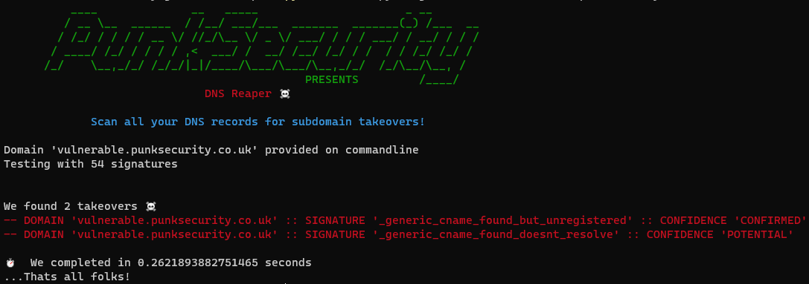

[](https://GitHub.com/punk-security/secret-magpie-cli/graphs/commit-activity)
[](https://www.punksecurity.co.uk)
[](https://hub.docker.com/r/punksecurity/dnsreaper)
[](https://sonarcloud.io/summary/new_code?id=punk-security_dnsReaper)
[](https://sonarcloud.io/summary/new_code?id=punk-security_dnsReaper)
[](https://sonarcloud.io/summary/new_code?id=punk-security_dnsReaper)

# DNS Reaper

DNS Reaper is yet another sub-domain takeover tool, but with an emphasis on accuracy, speed and the number of signatures in our arsenal!

We can scan around 50 subdomains per second, testing each one with over 50 takeover signatures.
This means most organisations can scan their entire DNS estate in less than 10 seconds.

To make it easier to get started, we've built a cheeky little web version that will scan a dns zone file, a comma-separated list, or up to 100 subdomains we find from ProjectDiscovery.  

Check it out: [dnsreaper web](https://punksecurity.co.uk/dnsreaper)


Of course the CLI tool is much more EPIC, and its faster.




### You can use DNS Reaper as an attacker or bug hunter!

 You can run it by providing a list of domains in a file, or a single domain on the command line.  DNS Reaper will then scan the domains with all of its signatures, producing a CSV file.

### You can use DNS Reaper as a defender! 

You can run it by letting it fetch your DNS records for you!  Yes that's right, you can run it with credentials and test all your domain config quickly and easily.  DNS Reaper will connect to the DNS provider and fetch all your records, and then test them.

We currently support AWS Route53, Cloudflare, and Azure. Documentation on adding your own provider can be found [here](/providers/readme.md)

### You can use DNS Reaper as a DevSecOps Pro!
[Punk Security](https://www.punksecurity.co.uk) are a DevSecOps company, and DNS Reaper has its roots in modern security best practice.

You can run DNS Reaper in a pipeline, feeding it a list of domains that you intend to provision, and it will exit Non-Zero if it detects a takeover is possible.  You can prevent takeovers before they are even possible!

## Usage 
To run DNS Reaper, you can use the docker image or run it with Python 3.11.

**Findings are returned in the output and more detail is provided in a local "results.csv" file.  We also support json output as an option.**

### Run it with docker

```shell
 docker run punksecurity/dnsreaper --help 
```

### Run it locally
> [!IMPORTANT]
> The minimum version of Python that dnsReaper supports is 3.9, but 3.11 is recommended. We attempt to maintain support for stable versions of Python that are not end-of-life.
We will not provide support or accept pull requests for issues that affect end-of-life versions of Python. See [Status of Python versions](https://devguide.python.org/versions/) for more information.

When running locally, we recommend using a virtual environment (venv) to avoid dependency conflicts.
Instructions available [Here](https://packaging.python.org/en/latest/guides/installing-using-pip-and-virtual-environments/#create-and-use-virtual-environments).

```shell
pip install -r requirements.txt
python main.py --help
```

### Common commands

* Scan AWS account:

    ``` docker run punksecurity/dnsreaper aws --aws-access-key-id <key> --aws-access-key-secret <secret> ```

    For more information, see [the documentation for the aws provider](/docs/aws.md)
* Scan all domains from file:

    ``` docker run -it --rm -v $(pwd):/etc/dnsreaper punksecurity/dnsreaper file --filename /etc/dnsreaper/<filename> ```
* Scan single domain

    ``` docker run -it --rm punksecurity/dnsreaper single --domain <domain> ```
* Scan single domain and output to stdout:

    You should either redirect the stderr output or save stdout output with >

    ``` docker run -it --rm punksecurity/dnsreaper single --domain <domain> --out stdout --out-format=json > output```
### Full usage

```
          ____              __   _____                      _ __
         / __ \__  ______  / /__/ ___/___  _______  _______(_) /___  __
        / /_/ / / / / __ \/ //_/\__ \/ _ \/ ___/ / / / ___/ / __/ / / /
       / ____/ /_/ / / / / ,<  ___/ /  __/ /__/ /_/ / /  / / /_/ /_/ /
      /_/    \__,_/_/ /_/_/|_|/____/\___/\___/\__,_/_/  /_/\__/\__, /
                                             PRESENTS         /____/
                              DNS Reaper ☠️

             Scan all your DNS records for subdomain takeovers!

usage:
main.py provider [options]

output:
  findings output to screen and (by default) results.csv

help:
main.py --help

providers:
  > aws - Scan multiple domains by fetching them from AWS Route53
  > azure - Scan multiple domains by fetching them from Azure DNS services
  > bind - Read domains from a dns BIND zone file, or path to multiple
  > cloudflare - Scan multiple domains by fetching them from Cloudflare
  > digitalocean - Scan multiple domains by fetching them from Digital Ocean
  > file - Read domains from a file (or folder of files), one per line
  > godaddy - Scan multiple domains by fetching them from GoDaddy
  > googlecloud - Scan multiple domains by fetching them from Google Cloud. Requires GOOGLE_APPLICATION_CREDENTIALS environment variable.
  > projectdiscovery - Scan multiple domains by fetching them from ProjectDiscovery
  > securitytrails - Scan multiple domains by fetching them from Security Trails
  > single - Scan a single domain by providing a domain on the commandline
  > zonetransfer - Scan multiple domains by fetching records via DNS zone transfer

positional arguments:
  {aws,azure,bind,cloudflare,digitalocean,file,godaddy,googlecloud,projectdiscovery,securitytrails,single,zonetransfer}

options:
  -h, --help            Show this help message and exit
  --out OUT             Output file (default: results) - use 'stdout' to stream out
  --out-format {csv,json}
  --resolver RESOLVER   Provide a custom DNS resolver
  --parallelism PARALLELISM
                        Number of domains to test in parallel - too high and you may see odd DNS results (default: 30)
  --disable-probable    Do not check for probable conditions
  --enable-unlikely     Check for more conditions, but with a high false positive rate
  --signature SIGNATURE
                        Only scan with this signature (multiple accepted)
  --exclude-signature EXCLUDE_SIGNATURE
                        Do not scan with this signature (multiple accepted)
  --pipeline            Exit Non-Zero on detection (used to fail a pipeline)
  -v, --verbose         -v for verbose, -vv for extra verbose
  --nocolour            Turns off coloured text

aws:
  Scan multiple domains by fetching them from AWS Route53

  --aws-access-key-id AWS_ACCESS_KEY_ID
                        Optional
  --aws-access-key-secret AWS_ACCESS_KEY_SECRET
                        Optional
  --aws-session-token AWS_SESSION_TOKEN
                        Optional

azure:
  Scan multiple domains by fetching them from Azure DNS services

  --az-subscription-id AZ_SUBSCRIPTION_ID
                        Required
  --az-tenant-id AZ_TENANT_ID
                        Required
  --az-client-id AZ_CLIENT_ID
                        Required
  --az-client-secret AZ_CLIENT_SECRET
                        Required

bind:
  Read domains from a dns BIND zone file, or path to multiple

  --bind-zone-file BIND_ZONE_FILE
                        Required

cloudflare:
  Scan multiple domains by fetching them from Cloudflare

  --cloudflare-token CLOUDFLARE_TOKEN
                        Required

digitalocean:
  Scan multiple domains by fetching them from Digital Ocean

  --do-api-key DO_API_KEY
                        Required
  --do-domains DO_DOMAINS
                        Optional

file:
  Read domains from a file (or folder of files), one per line

  --filename FILENAME   Required

projectdiscovery:
  Scan multiple domains by fetching them from ProjectDiscovery

  --pd-api-key PD_API_KEY
                        Required
  --pd-domains PD_DOMAINS
                        Required

godaddy:
  Scan multiple domains by fetching them from GoDaddy
  
  --gd-api-key GD_API_KEY
                        Required
  --gd-api-secret GD_API_SECRET
                        Required
  --gd-domains GD_DOMAINS
                        Optional

googlecloud:
  Scan multiple domains by fetching them from Google Cloud. Requires GOOGLE_APPLICATION_CREDENTIALS environment variable.

  --project-id PROJECT_ID
                        Required

projectdiscovery:
  Scan multiple domains by fetching them from ProjectDiscovery

  --pd-api-key PD_API_KEY
                        Required
  --pd-domains PD_DOMAINS
                        Required

securitytrails:
  Scan multiple domains by fetching them from Security Trails

  --st-api-key ST_API_KEY
                        Required
  --st-domains ST_DOMAINS
                        Required

googlecloud:
  Scan multiple domains by fetching them from Google Cloud

  --project-id PROJECT_ID
                        Required

projectdiscovery:
  Scan multiple domains by fetching them from ProjectDiscovery

  --pd-api-key PD_API_KEY
                        Required
  --pd-domains PD_DOMAINS
                        Optional

securitytrails:
  Scan multiple domains by fetching them from Security Trails

  --st-api-key ST_API_KEY
                        Required
  --st-domains ST_DOMAINS
                        Optional

single:
  Scan a single domain by providing a domain on the commandline

  --domain DOMAIN       Required

zonetransfer:
  Scan multiple domains by fetching records via DNS zone transfer

  --zonetransfer-nameserver ZONETRANSFER_NAMESERVER
                        Required
  --zonetransfer-domain ZONETRANSFER_DOMAIN
                        Required
```
